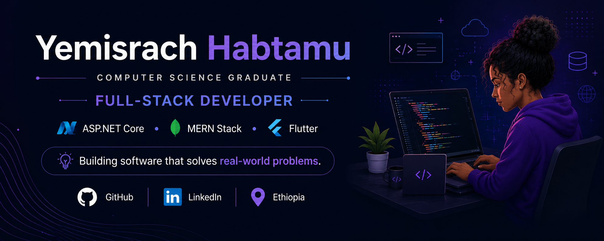

  

# Hi there! 👋 I'm Yemisrach Habtamu

🎓 **Computer Science Graduate**

💻 **Full-Stack Developer** passionate about building modern, user-friendly web applications.

---

## 🚀 About Me

- 🎓 Computer Science Graduate
- 💻 Full-Stack Developer
- 🌐 Experienced with ASP.NET Core, MERN Stack, and Flutter
- 🧠 Passionate about AI-powered software solutions
- 🔐 Currently learning Cybersecurity and Ethical Hacking
- 📚 Always learning new technologies and best practices
- 🤝 Open to internships, graduate programs, and software engineering opportunities
- 📍 Ethiopia

---

## 🛠 Tech Stack

### Languages
- C#
- JavaScript
- Dart
- Python
- Java
- SQL
- C++

### Frameworks & Technologies
- ASP.NET Core MVC
- MERN Stack
- Flutter
- Entity Framework Core

### Databases
- SQL Server
- MongoDB

### Tools
- Git
- GitHub
- Visual Studio
- VS Code
- Draw.io

---

## 📂 Featured Projects

## 🧠 Mental Health Support System (Web & Mobile)

A modern AI-powered mental health platform that connects clients with licensed mental health professionals through intelligent assessments, secure communication, appointment scheduling, and mobile accessibility.

### 🚀 Features

- 🔐 Secure User Authentication (JWT)
- Therapist Verification
- 📝 Mental Health Assessment
- AI Recommendation 
- 💬 AI Chat Support *(Planned)*
- 📅 Appointment Booking 
- Secure Messaging
- Video Consultation (Planned)
- Payment Integration
- Reviews & Ratings
- 🔔 Notifications and Reminders
- 📱 Responsive Design
- 📱Flutter Mobile Application (Planned)
  

### Technologies

**Status:** 🚧 Currently Developing

---

### Internship Connection Hub
A centralized internship management platform developed to streamline the internship process between students, organizations, and system administrators.

### Features

- Student Registration
- Organization Verification
- Internship Posting
- Internship Search
- Online Application
- Document Upload
- Application Tracking
- Notifications
- Admin Dashboard
- Role-Based Access Control

### Technologies

- ASP.NET Core MVC
- Entity Framework Core
- SQL Server

---

## 📱 Habit Tracker

A Flutter application designed to help users build productive habits and monitor daily progress.

### Features

- Daily Habit Tracking
- Progress Dashboard
- Local Storage
- Clean User Interface

### Technologies

- Flutter
- Dart

---

## 📊 GitHub Stats

# 🌱 Currently Learning

- 🔐 Cybersecurity Fundamentals
- 🛡️ Ethical Hacking

---

## 📫 Connect with Me

- 💻 GitHub: https://github.com/Yoangeliwon
- 💼 LinkedIn: https://www.linkedin.com/in/yemisrach-habtamu-a24465313/
- 📧 Email: yemisrachhabtamu4@gmail.com

---

## 💡 Favorite Quote

> "Technology has the power to improve lives. I strive to build software that creates meaningful impact."

⭐ Thank you for visiting my profile!

<!--
**Yoangeliwon/Yoangeliwon** is a ✨ _special_ ✨ repository because its `README.md` (this file) appears on your GitHub profile.

Here are some ideas to get you started:

- 🔭 I’m currently working on ...
- 🌱 I’m currently learning ...
- 👯 I’m looking to collaborate on ...
- 🤔 I’m looking for help with ...
- 💬 Ask me about ...
- 📫 How to reach me: ...
- 😄 Pronouns: ...
- ⚡ Fun fact: ...
-->
